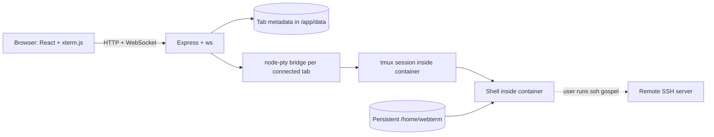

# FlanTerminal

FlanTerminal is a self-hosted, Dockerized browser terminal intended to replace
GoTTY for a small trusted deployment. It provides multiple persisted browser
tabs, one container-local tmux session per tab, and manual outbound SSH from
those shells. Remote machines need only their existing SSH server; they do not
need tmux, an agent, or FlanTerminal software.



## Implemented scope

Phase 2 includes:

- Multiple browser tabs with create, select, rename, drag reorder, close, and
  keyboard navigation.
- An immutable UUID and derived safe tmux name per tab. Display names are never
  passed to tmux or a shell.
- Atomic JSON metadata persistence in `/app/data/tabs.json`; terminal output and
  scrollback are not stored in the database.
- One exclusive browser/PTy bridge per tab. A second connection replaces the
  first bridge without killing the tmux session.
- Reconnect, detach, clear browser scrollback, restart terminal client, restart
  bridge, terminate, recreate, and restart-session controls.
- xterm.js with FitAddon, WebLinksAddon, ANSI/Unicode/mouse support, bounded
  scrollback, resize debounce, heartbeat, backpressure, and reconnect backoff.
- Bundled JetBrainsMono Nerd Font, with local Unicode, symbol, emoji, and
  monospace fallbacks.
- OpenSSH client and a separately persisted `/home/webterm`.
- A non-root, read-only-root Docker runtime with dropped capabilities,
  `no-new-privileges`, health checks, structured logs, and no Docker socket.

Authentication, trusted proxy headers, settings/themes, administration UI,
stale-session cleanup, and supported reverse-proxy deployment examples are
Phase 3 work. Phase 2 has **no authentication**. Compose publishes only to
`127.0.0.1` by default. Do not expose it to a LAN or the Internet without a
separate authenticated access layer.

## Start with Docker Compose

Prerequisites are Docker Engine and the Docker Compose plugin.

```sh
cp .env.example .env
# Review .env before starting.
docker compose up -d --build --wait
docker compose ps
```

Open <http://localhost:3000>. Follow structured logs with:

```sh
docker compose logs -f app
```

The default mapping is `127.0.0.1:3000` on the host to port `3000` inside the
container. Change `HOST_PORT` and `APP_PUBLIC_URL` together when using another
host port.

`docker compose down` removes the container and network but retains both named
volumes. Do not use `docker compose down -v` unless you intend to delete tab
metadata, SSH configuration, keys, history, and home files.

## Tabs and keyboard shortcuts

The application opens directly to the terminal workspace. The plus button
creates and selects a new tab. Double-click a tab label to rename it. Drag tabs
to reorder them; Move left and Move right in the session menu are keyboard and
touch alternatives. Closing a tab requires confirmation and terminates its tmux
session before removing metadata.

Shortcuts:

| Shortcut                | Action                                       |
| ----------------------- | -------------------------------------------- |
| `Ctrl+Shift+T`          | Create and select a tab                      |
| `Ctrl+Shift+W`          | Open close confirmation for the selected tab |
| `Ctrl+Tab`              | Select next tab, wrapping at the end         |
| `Ctrl+Shift+Tab`        | Select previous tab, wrapping at the start   |
| `Alt+1` through `Alt+9` | Select the corresponding tab                 |

These shortcuts work while xterm has focus but do not intercept inline rename
fields or confirmation dialogs.

The selected tab's session menu provides:

- **Reconnect:** replace only the current browser/PTy attachment.
- **Detach browser:** close this client and disable automatic reconnect. tmux
  remains alive.
- **Clear scrollback:** clear only the local xterm buffer.
- **Restart terminal client:** recreate xterm and its WebSocket without killing
  tmux.
- **Restart bridge:** replace the node-pty attachment and reconnect to tmux.
- **Restart session:** confirm, kill only this tab's tmux session, create a new
  shell, and reconnect.
- **Terminate session:** confirm and stop only this tab's tmux session while
  retaining its tab metadata.
- **Recreate session:** create a fresh tmux session for a stopped tab.

## Persistence model

Two named volumes serve different purposes:

- `app-data` mounted at `/app/data`: ordered tab definitions, display names,
  desired active/stopped state, timestamps, and structural revision.
- `webterm-home` mounted at `/home/webterm`: `.ssh`, shell configuration,
  history, user scripts, and other home files.

Browser disconnect, reload, browser restart, detach, or bridge restart kills the
tab's PTY bridge but leaves its tmux session and child processes alive. Reconnect
attaches to the same container-local tmux session.

A container stop, restart, recreation, host reboot, or image upgrade terminates
all tmux processes and active shells. Both volumes survive, so tabs and home
files return, but an active shell, environment variables, SSH connection, vim,
or htop process does not. Selecting an active-intent restored tab starts a fresh
shell. A tab explicitly terminated before the restart remains stopped until
Recreate is selected.

### Test disconnect and reconnect

1. Open a tab and run:

   ```sh
   export FLANTERMINAL_RECONNECT_MARKER=browser-reconnect-ok
   printf '%s\n' "$FLANTERMINAL_RECONNECT_MARKER"
   ```

2. Reload the page, close and reopen the browser window, use Detach then
   Reconnect, or temporarily interrupt the network.
3. Select the same tab and run:

   ```sh
   printf '%s\n' "$FLANTERMINAL_RECONNECT_MARKER"
   ```

The output should be `browser-reconnect-ok`. It will not survive a container
restart because the marker lives in the tmux shell process, not a volume.

## SSH setup

The image includes `openssh-client` and does not generate or expose private
keys. Install existing SSH material into `/home/webterm/.ssh` as `webterm`.
These commands refuse to overwrite an existing file:

```sh
docker compose exec -T app sh -c \
  'set -eu; umask 077; mkdir -p "$HOME/.ssh"; test ! -e "$HOME/.ssh/id_ed25519"; temporary=$(mktemp "$HOME/.ssh/id_ed25519.XXXXXX"); trap '\''rm -f "$temporary"'\'' EXIT; cat > "$temporary"; chmod 600 "$temporary"; mv "$temporary" "$HOME/.ssh/id_ed25519"; trap - EXIT' \
  < /path/to/id_ed25519
docker compose exec -T app chmod 700 /home/webterm/.ssh
```

Create `~/.ssh/config` similarly, or use an interactive container shell. Example
values are illustrative and may not match your network:

```sshconfig
Host gospel
    HostName 192.168.1.50
    User example-user
    IdentityFile ~/.ssh/id_ed25519
```

Then run `ssh gospel` in any FlanTerminal tab. Verify host-key fingerprints over
an independent trusted channel before adding them to `known_hosts`; do not
disable host-key checking. Optional SSH agent forwarding may be configured by
mounting one intentionally selected agent socket and setting `SSH_AUTH_SOCK`,
but it is not required or enabled by default.

## Configuration

Copy `.env.example` to `.env`. Invalid strict settings stop startup;
`XTERM_SCROLLBACK` is clamped to its supported range.

| Variable                |                  Default | Meaning                                               |
| ----------------------- | -----------------------: | ----------------------------------------------------- |
| `APP_PORT`              |                   `3000` | Internal port, integer `1..65535`                     |
| `HOST_PORT`             |                   `3000` | Loopback host port published by Compose               |
| `APP_BIND_HOST`         |                `0.0.0.0` | Bind address inside the container                     |
| `APP_BASE_PATH`         |                      `/` | Root or safe non-encoded path such as `/terminal`     |
| `APP_PUBLIC_URL`        |  `http://localhost:3000` | Exact trusted browser origin, with no path            |
| `DATA_DIR`              |              `/app/data` | Absolute metadata directory; Compose fixes this mount |
| `HOME_DIR`              |          `/home/webterm` | Absolute shell home; Compose fixes this mount         |
| `SESSION_MAX_COUNT`     |                     `10` | Persisted tab limit, integer `1..20`                  |
| `DEFAULT_SHELL`         |              `/bin/bash` | Absolute executable path, verified at startup         |
| `DEFAULT_FONT_SIZE`     |                     `14` | xterm font size, integer `8..32`                      |
| `XTERM_SCROLLBACK`      |                  `10000` | Browser lines, clamped to `0..100000`                 |
| `TMUX_HISTORY_LIMIT`    |                  `20000` | tmux lines, integer `0..1000000`                      |
| `WS_HEARTBEAT_SECONDS`  |                     `30` | Ping interval, integer `5..300`                       |
| `WS_MAX_BUFFER_BYTES`   |                `1048576` | Pending output limit, `65536..1048576`                |
| `RESIZE_DEBOUNCE_MS`    |                    `100` | Browser resize debounce, `25..1000`                   |
| `RECONNECT_MAX_SECONDS` |                     `15` | Retry cap, integer `1..60`                            |
| `LOG_LEVEL`             |                   `info` | Pino level or `silent`                                |
| `PUID` / `PGID`         |                   `1000` | Build-time runtime identity; rebuild after changing   |
| `TZ`                    | example `America/Denver` | Deployment timezone; Compose falls back to `UTC`      |

Backend safety maximums cannot be raised through browser requests. The normal
Compose default is 10 tabs; the isolated stress verifier overrides it to 20.

## Performance and resource bounds

FlanTerminal does not record terminal input or output. Bounded state includes:

- Browser scrollback: 10,000 lines by default.
- tmux history: 20,000 lines per pane by default.
- WebSocket payload: 64 KiB; input data: 16 KiB.
- Pending socket output: 1 MiB by default, with backpressure closure.
- Resize debounce: 100 ms.
- Heartbeat: 30 seconds.
- Reconnect delays: 0.5, 1, 2, 4, and 8 seconds, then the configured cap.
- At most one node-pty bridge per tab, with keyed replacement and disconnect
  cleanup.
- Compose limits: 512 MiB and 256 PIDs.

Activity timestamps are coalesced into one bounded dirty set and periodic write.
There is no in-memory terminal history on the server. Reduce scrollback, tmux
history, or buffer limits for constrained clients or high-output workloads.

## Font licensing

The client bundles JetBrainsMono Nerd Font v3.4.0 as a local TTF and makes no
font CDN request. Source/archive hashes are in [LICENSES/README](LICENSES/README)
and the SIL OFL is in
[LICENSES/JetBrainsMono-OFL.txt](LICENSES/JetBrainsMono-OFL.txt). CSS fallbacks
include `ui-monospace`, `Noto Sans Mono`, `Symbols Nerd Font`,
`Noto Color Emoji`, and `monospace`.

## Health and logs

Health routes remain outside `APP_BASE_PATH`:

- `GET /health`: status, uptime, RSS/heap bytes, active PTY bridges, and
  connected WebSockets.
- `GET /ready`: HTTP 200 only after listening and while metadata durability is
  healthy; otherwise HTTP 503.

Pino logs startup, terminal bridge open/close, protocol rejection,
backpressure, and bounded failures. Terminal keystrokes, terminal output, SSH
passwords, keys, secret environment values, and response bodies are not logged.

## HTTP API and origin protection

Tab routes live under `APP_BASE_PATH/api/tabs`. GET requests are read-only.
POST, PUT, PATCH, and DELETE requests require the browser's exact `Origin` to
match `APP_PUBLIC_URL`; JSON mutations also require `application/json`. IDs must
be canonical lowercase UUIDs. The WebSocket path is:

```text
<APP_BASE_PATH>/ws/sessions/<tab-uuid>
```

Unknown, stopped, malformed, or unauthorized session IDs are rejected before a
WebSocket upgrade or PTY allocation. SSH files have no HTTP route.

## Development and verification

Local development requires Node.js 24+, npm, tmux at `/usr/bin/tmux`, and SSH at
`/usr/bin/ssh`.

```sh
npm ci
HOME_DIR="$HOME" DATA_DIR=/tmp/flanterminal-data npm run dev
```

Open <http://localhost:5173>. Vite proxies `/api` and `/ws` to the backend on
port 3000. The development Dockerfile is also available:

```sh
docker build -f Dockerfile.dev -t flanterminal-dev .
docker run --rm -it \
  -p 127.0.0.1:5173:5173 \
  -p 127.0.0.1:3000:3000 \
  flanterminal-dev
```

Quality commands:

```sh
npm run format:check
npm run lint
npm run typecheck
npm test
npm run build
npm run test:e2e
./scripts/verify-container.sh
./scripts/verify-container.sh --check hardening
```

Playwright builds the production image and tests both `/` and `/terminal/` at
desktop, tablet, and phone viewports. The container verifier checks independent
tmux sessions, session limits, 20 simultaneous idle attachments, PTY cleanup,
metadata/home persistence, process loss on recreation, health, non-root
ownership, read-only boundaries, and absence of terminal output in logs.

## Backup and restore

Back up both volumes while the app is stopped so metadata and home files are
quiescent:

```sh
mkdir -p backups
docker compose stop app
docker compose run --rm --no-deps -T app \
  tar -C /app/data -cpf - . > backups/app-data.tar
docker compose run --rm --no-deps -T app \
  tar -C /home/webterm -cpf - . > backups/webterm-home.tar
docker compose start app
docker compose ps
```

Inspect archives before restore:

```sh
tar -tf backups/app-data.tar | less
tar -tf backups/webterm-home.tar | less
```

Restore only into the intended stopped deployment with matching `PUID`/`PGID`:

```sh
docker compose stop app
docker compose run --rm --no-deps -T app \
  tar -C /app/data -xpf - < backups/app-data.tar
docker compose run --rm --no-deps -T app \
  tar -C /home/webterm -xpf - < backups/webterm-home.tar
docker compose start app
docker compose ps
```

This is an overlay restore and does not remove newer paths. For an exact
rollback, restore into new empty volumes and verify them in a separate Compose
project before switching the deployment.

## Upgrade from Phase 1 and later upgrades

Phase 1 used only `webterm-home` and one fixed tmux session. Phase 2 adds
`app-data` and initializes it with `Terminal 1` on first startup. The old active
tmux process cannot migrate and ends when the container is recreated; home and
SSH files remain in `webterm-home`.

```sh
docker compose stop app
# Back up webterm-home before changing images.
docker compose build --pull
docker compose up -d --force-recreate --wait
docker compose ps
curl --fail http://localhost:3000/health
curl --fail http://localhost:3000/ready
```

For later Phase 2 upgrades, back up both volumes first. Retain or tag the prior
image for rollback. There is no live tmux-session migration.

## Reverse proxies

Phase 2 understands a configured base path and exact public origin and supports
WebSocket upgrades, but it does not yet trust forwarded headers or authenticate
users. Traefik and Nginx deployment examples are intentionally deferred to
Phase 3 so they can include the required authentication and trusted-proxy
model. Do not publish an unauthenticated proxy configuration.

When testing behind an already secured private proxy, it must preserve the
browser `Origin`, proxy WebSocket upgrades, route `APP_BASE_PATH`, and use an
external origin exactly matching `APP_PUBLIC_URL`. FlanTerminal does not infer
these values from forwarded headers in Phase 2.

## Security considerations

- Treat the terminal as arbitrary shell access with all privileges of the
  `webterm` user.
- Keep the default loopback binding until authentication is implemented.
- The runtime is non-root, root is read-only, capabilities are dropped,
  `no-new-privileges` is enabled, and no Docker socket is mounted.
- Writable mounts are limited to `/app/data`, `/home/webterm`, `/tmp`, and
  `/run`.
- Protect and encrypt backups because `webterm-home` may contain private keys.
- Keep `.ssh` at mode `700`, private/config/known-host files at `600`, and public
  keys at `644`.
- Do not put secrets in tab names. Names are validated and never used in tmux
  commands, but they are persisted metadata and displayed in the browser.

## Troubleshooting

**WebSocket 403 or reconnect loop:** `APP_PUBLIC_URL` must exactly match the
browser scheme, host, and port. Check `docker compose logs app`.

**Mutation 403:** the request Origin does not exactly match `APP_PUBLIC_URL`.
Do not attempt to set Origin from browser JavaScript.

**Base-path redirect or 404:** configure `APP_BASE_PATH=/terminal` without a
trailing slash, then browse to `/terminal/`.

**Metadata permission or readiness failure:** confirm `/app/data` is mounted,
writable by `PUID`/`PGID`, contains no symlinked `tabs.json`, and has free disk
space. Check `/ready` and structured logs.

**Home permission denied:** align volume ownership with `PUID`/`PGID` and
rebuild after identity changes.

**SSH rejects a key or host:** check `.ssh` and file modes and independently
verify the server fingerprint. Do not disable verification.

**Session stopped after container restart:** expected. Tab metadata survives;
tmux processes do not. Select an active tab to start a fresh shell or choose
Recreate for a tab intentionally stopped before restart.

**Slow or heavy output:** reduce xterm scrollback, tmux history, or buffer size.
Backpressure closes only the bridge; reconnect attaches to the same tmux shell.

## Known limitations and next phase

Phase 2 does not provide authentication, user isolation, settings/themes,
administration/metrics UI, stale-session cleanup, trusted proxy headers, or
supported public reverse-proxy configurations. It supports one exclusive
browser bridge per tab, not collaborative sharing. Processes do not survive a
container lifecycle event, and terminal scrollback is not stored server-side.

The recommended Phase 3 adds local or trusted-header authentication, secure
cookies and CSRF integration, settings/themes, administration and metrics
views, stale-session cleanup, and documented Traefik/Nginx deployments.
