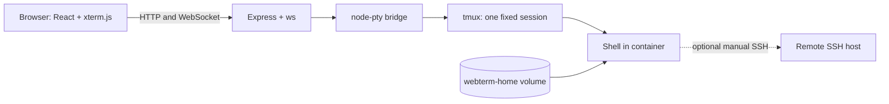

# FlanTerminal

FlanTerminal is a self-hosted Docker web terminal intended to replace GoTTY for
a small, trusted deployment. Phase 1 provides one fixed terminal: the browser
runs React and xterm.js, Express carries terminal traffic over WebSocket,
`node-pty` attaches to tmux inside the container, and the user may manually SSH
onward from that shell.



## Phase 1 scope

Implemented now:

- One fixed terminal and tmux session, `webterm-phase-1-main`
- Responsive xterm.js UI with a bundled Nerd Font, resize handling, connection
  status, automatic retries, and a manual reconnect button
- Same-container tmux persistence across browser disconnects, reloads, and
  browser restarts
- Persistent `/home/webterm` volume for SSH files, shell history, and home files
- Origin-checked WebSocket upgrades, bounded protocol messages, health checks,
  structured lifecycle logs, and a hardened non-root container

Phase 1 has **no authentication**. Compose publishes only to `127.0.0.1` by
default. Do not expose this service to a LAN or the Internet: the terminal is a
full shell running with all privileges of the `webterm` user.

Multiple tabs, persisted terminal metadata, tab lifecycle and shortcuts,
settings, authentication, admin features, stale-session cleanup, and supported
reverse-proxy examples are not implemented. Persisted multi-tab metadata and
lifecycle are the recommended Phase 2 work. Authentication and proxy hardening
belong in Phase 3.

## Start

Prerequisites are Docker Engine and the Docker Compose plugin (`docker compose`).

```sh
cp .env.example .env
# Review .env before starting.
docker compose up -d --build --wait
docker compose ps
```

Open <http://localhost:3000>. Follow logs with:

```sh
docker compose logs -f app
```

The default mapping is loopback-only: `127.0.0.1:3000` on the host to port
`3000` in the container. `docker compose stop` stops the existing container;
`docker compose start` starts it again. `docker compose down` removes the
container and network but retains the named home volume. Both operations stop
the container and therefore terminate active tmux processes. Do not casually
use `docker compose down -v`: `-v` deletes the persistent home volume.

## Persistence model

There are two different kinds of persistence:

- Browser disconnect, reload, reconnect, or browser restart: the PTY bridge is
  replaced, but the tmux shell remains alive in the running container.
- Container stop, restart, removal, recreation, host reboot, or image upgrade:
  tmux and its child processes die. The named `/home/webterm` volume survives.

In particular, `docker compose up --force-recreate` does **not** preserve an
active process. It preserves only data stored in the home volume.

Only one live browser bridge is supported. Opening or reconnecting another
client closes the prior bridge and attaches the new client to the same tmux
session. The replaced client stays disconnected until its reconnect control is
used. This is intentional replacement behavior, not multi-user sharing.

### Verify browser reconnection

Use a harmless shell variable; it exists only in the active tmux shell:

1. Start FlanTerminal and open <http://localhost:3000>.
2. Run:

   ```sh
   export FLANTERMINAL_RECONNECT_MARKER=browser-reconnect-ok
   printf '%s\n' "$FLANTERMINAL_RECONNECT_MARKER"
   ```

3. Reload, close and reopen the browser tab, or click the reconnect icon in the
   top bar (tooltip: **Reconnect terminal**).
4. Wait for **Connected**, then run:

   ```sh
   printf '%s\n' "$FLANTERMINAL_RECONNECT_MARKER"
   ```

The output should be `browser-reconnect-ok`. This proves browser reconnection
only. The variable and shell do not survive a container restart or recreation.

## Persistent SSH setup

The image includes `openssh-client`, but FlanTerminal does not generate keys or
configure SSH automatically. SSH files belong under the persistent
`/home/webterm/.ssh`; they are never served over HTTP. These commands write
through stdin as `webterm`, so ownership is correct.

Create an SSH config only if one does not already exist. The command writes a
temporary file and refuses to replace persistent configuration:

```sh
docker compose exec -T app sh -c \
  'set -eu; umask 077; mkdir -p "$HOME/.ssh"; test ! -e "$HOME/.ssh/config" && test ! -L "$HOME/.ssh/config"; temporary=$(mktemp "$HOME/.ssh/config.XXXXXX"); trap '\''rm -f "$temporary"'\'' EXIT; cat > "$temporary"; chmod 600 "$temporary"; mv "$temporary" "$HOME/.ssh/config"; trap - EXIT' <<'EOF'
Host gospel
    HostName 192.168.1.50
    User example-user
    IdentityFile ~/.ssh/id_ed25519
EOF
```

Those host, address, and user values are illustrative. Back up existing SSH
files before changing them. Install an existing key without pasting it into the
browser; these commands refuse to overwrite an existing key:

```sh
docker compose exec -T app sh -c \
  'set -eu; umask 077; mkdir -p "$HOME/.ssh"; test ! -e "$HOME/.ssh/id_ed25519" && test ! -L "$HOME/.ssh/id_ed25519"; temporary=$(mktemp "$HOME/.ssh/id_ed25519.XXXXXX"); trap '\''rm -f "$temporary"'\'' EXIT; cat > "$temporary"; chmod 600 "$temporary"; mv "$temporary" "$HOME/.ssh/id_ed25519"; trap - EXIT' \
  < /path/to/id_ed25519
docker compose exec -T app sh -c \
  'set -eu; umask 077; mkdir -p "$HOME/.ssh"; test ! -e "$HOME/.ssh/id_ed25519.pub" && test ! -L "$HOME/.ssh/id_ed25519.pub"; temporary=$(mktemp "$HOME/.ssh/id_ed25519.pub.XXXXXX"); trap '\''rm -f "$temporary"'\'' EXIT; cat > "$temporary"; chmod 644 "$temporary"; mv "$temporary" "$HOME/.ssh/id_ed25519.pub"; trap - EXIT' \
  < /path/to/id_ed25519.pub
docker compose exec -T app chmod 700 /home/webterm/.ssh
```

Collect a host key, inspect its fingerprint, and compare that fingerprint
through a trusted independent channel before installing it:

```sh
hostkeys=$(mktemp)
trap 'rm -f "$hostkeys"' EXIT INT TERM
docker compose exec -T app ssh-keyscan 192.168.1.50 2>/dev/null > "$hostkeys"
docker compose exec -T app ssh-keygen -lf - < "$hostkeys"
# Stop here until the fingerprint is independently verified.
docker compose exec -T app sh -c \
  'set -eu; umask 077; mkdir -p "$HOME/.ssh"; test ! -L "$HOME/.ssh/known_hosts"; cat >> "$HOME/.ssh/known_hosts"; chmod 600 "$HOME/.ssh/known_hosts"' \
  < "$hostkeys"
rm -f "$hostkeys"
trap - EXIT INT TERM
```

`ssh-keyscan` alone does not authenticate a host. After verification, run
`ssh gospel`. Agent forwarding is optional and unnecessary here. If required,
mount only an intentionally selected agent socket and configure `SSH_AUTH_SOCK`;
do not broadly mount a host home, `.ssh` directory, or unrelated sockets.

## Configuration

Copy [.env.example](.env.example) to `.env`. Invalid strict values stop startup;
`XTERM_SCROLLBACK` is the exception and is clamped into its documented range.

| Variable                |                  Default | Meaning and validation                                                                                                                                                    |
| ----------------------- | -----------------------: | ------------------------------------------------------------------------------------------------------------------------------------------------------------------------- |
| `APP_PORT`              |                   `3000` | Internal port, integer `1..65535`; also a build argument.                                                                                                                 |
| `HOST_PORT`             |                   `3000` | Host-side loopback port published by Compose.                                                                                                                             |
| `APP_BIND_HOST`         |                `0.0.0.0` | Address inside the container. Compose still controls host exposure.                                                                                                       |
| `APP_BASE_PATH`         |                      `/` | `/` or safe segments using letters, digits, `.`, `_`, `~`, `-`; no encoded or trailing slash. The workspace URL is canonical with a trailing slash, such as `/terminal/`. |
| `APP_PUBLIC_URL`        |  `http://localhost:3000` | Exact browser origin for WebSocket checks: `http`/`https`, no path, credentials, query, or fragment. Include a non-default port.                                          |
| `DEFAULT_SHELL`         |              `/bin/bash` | Absolute executable path; verified at startup.                                                                                                                            |
| `DEFAULT_FONT_SIZE`     |                     `14` | xterm font size, integer `8..32`.                                                                                                                                         |
| `XTERM_SCROLLBACK`      |                  `10000` | Browser scrollback, clamped to `0..100000`.                                                                                                                               |
| `TMUX_HISTORY_LIMIT`    |                  `20000` | tmux history, integer `0..1000000`; captured when a pane is created.                                                                                                      |
| `WS_HEARTBEAT_SECONDS`  |                     `30` | Native WebSocket ping interval, integer `5..300`.                                                                                                                         |
| `WS_MAX_BUFFER_BYTES`   |                `1048576` | Pending output limit, integer `65536..1048576`.                                                                                                                           |
| `RESIZE_DEBOUNCE_MS`    |                    `100` | Browser resize debounce, integer `25..1000`.                                                                                                                              |
| `RECONNECT_MAX_SECONDS` |                     `15` | Retry cap, integer `1..60`. Delays are `0.5`, `1`, `2`, `4`, `8` seconds, each capped; later retries use the cap.                                                         |
| `LOG_LEVEL`             |                   `info` | `trace`, `debug`, `info`, `warn`, `error`, `fatal`, or `silent`.                                                                                                          |
| `PUID`                  |                   `1000` | Build-time `webterm` UID. Changes require rebuilding; align volume ownership.                                                                                             |
| `PGID`                  |                   `1000` | Build-time `webterm` GID. Changes require rebuilding; align volume ownership.                                                                                             |
| `TZ`                    | example `America/Denver` | Set for the deployment. The example is not required; Compose falls back to `UTC` if unset.                                                                                |
| `HOME_DIR`              |          `/home/webterm` | Fixed by Compose; tmux working directory and persistent home mount.                                                                                                       |

Rebuild after changing `PUID`, `PGID`, or `APP_PORT`:

```sh
docker compose up -d --build --wait
```

## Performance and resources

FlanTerminal does not log or store terminal input/output and has no history
database. History is bounded by xterm (10,000 lines by default) and tmux (20,000
lines). The tmux limit is set when the pane is created; an existing pane must be
ended and recreated for a new limit to apply.

Server output backpressure is 1 MiB by default. Protocol frames are at most 64
KiB and input within a message is at most 16 KiB. Resize is debounced by 100 ms.
Native WebSocket ping/pong runs every 30 seconds, reconnect is bounded, only one
PTY bridge is active, and bridge cleanup kills its attach PTY without killing
tmux. Compose limits the service to 256 MiB and 128 PIDs.

For a slow browser or link, reduce `XTERM_SCROLLBACK`, `TMUX_HISTORY_LIMIT`, and
`WS_MAX_BUFFER_BYTES`. Heavy output can close the bridge at the buffer limit;
the browser then reconnects.

## Font

The client bundles regular JetBrainsMono Nerd Font from Nerd Fonts v3.4.0 as a
2,469,104-byte (about 2.47 MB) local TTF with no CDN. Source and archive SHA-256
are in [LICENSES/README](LICENSES/README); the SIL OFL is in
[LICENSES/JetBrainsMono-OFL.txt](LICENSES/JetBrainsMono-OFL.txt). CSS falls back
to `ui-monospace`, `Noto Sans Mono`, `Symbols Nerd Font`, `Noto Color Emoji`,
and `monospace`.

## Health and logs

Health endpoints are outside `APP_BASE_PATH`:

- `GET /health` returns `status: "ok"`, uptime, RSS and heap-used bytes, active
  session count, and connected WebSocket count.
- `GET /ready` returns HTTP 200 and `{ "status": "ready", "ready": true }`
  after listening, or HTTP 503 with `not_ready` and `false`.

Docker health uses `/health`; inspect it with `docker compose ps`. Pino writes
structured JSON lifecycle events including `server_started`, `terminal_opened`,
`terminal_closed`, protocol rejection, backpressure, and failures. Logs do not
include terminal input/output, SSH keys, or secrets; sensitive metadata keys are
redacted. Control verbosity with `LOG_LEVEL`.

## Development

Local development requires Node.js 24+, npm, `openssh-client`, and tmux. The
server currently verifies tmux at exact path `/usr/bin/tmux` and SSH at
`/usr/bin/ssh`.

```sh
npm ci
HOME_DIR="$HOME" npm run dev
```

This builds shared once, then runs its TypeScript watcher, Vite on 5173, and the
`tsx` backend watcher on 3000. Open <http://localhost:5173>; Vite proxies `/api`
and `/ws` to the backend.

Containerized development smoke run:

```sh
docker build -f Dockerfile.dev -t flanterminal-dev .
docker run --rm -it \
  -p 127.0.0.1:5173:5173 \
  -p 127.0.0.1:3000:3000 \
  flanterminal-dev
```

Open <http://localhost:5173>. [Dockerfile.dev](Dockerfile.dev) copies source at
build time, so rebuild for edits. There is no development Compose file.
Production does not persist `node_modules`; only `/home/webterm` is a volume.

```sh
npm run lint
npm run format:check
npm run typecheck
npm test
npm run build
npm run test:e2e
scripts/verify-container.sh
scripts/verify-container.sh --check hardening
```

E2E uses an isolated Compose project and volume and tests `/` and `/terminal`.
The first run may take longer while pulling the Playwright image. The container
verifier covers runtime and hardening; the selector runs hardening alone.
Completed acceptance also covered default and `PUID=1100`/`PGID=1100`
identities and the development smoke path.

Current verified suite: 257 Vitest tests (26 client, 184 server, 47 shared), four
Playwright tests at `/` plus four at `/terminal`, the container verifier,
default and 1100 identities, and the development smoke test.

## Reverse proxies

Phase 1 has no authentication or trusted-forwarded-header handling. Although it
supports a base path, exact public origin, and WebSocket upgrades, Traefik and
Nginx exposure examples are deferred until Phase 3 authentication hardening. Do
not publish an unauthenticated proxy configuration.

When a future proxy authentication layer exists, it must pass WebSocket upgrades
and `APP_PUBLIC_URL` must equal the browser's exact external origin. Set
`APP_BASE_PATH` to the routed path. FlanTerminal does not infer these from proxy
headers.

## Security considerations

- No Phase 1 authentication: retain the loopback host mapping.
- The image runs as non-root `webterm`; configurable IDs are build-time values.
- Root is read-only, all capabilities are dropped, `no-new-privileges` is set,
  and writable `/tmp`, `/run`, and home mounts are narrowly scoped.
- No Docker socket is mounted. Do not add one.
- Keep SSH private/config/known-host files in home at mode `600`, `.ssh` at
  `700`, and public keys at `644`.
- Exact origin checks, Helmet headers, and bounded protocol, resize, buffering,
  and heartbeat values reduce the HTTP/WebSocket surface.
- A terminal is arbitrary shell access as `webterm`. Protect the home volume and
  backups as credentials; restrict and encrypt backups where appropriate.

## Home volume, backup, and restore

The logical volume is `webterm-home`. Its default actual name is
`flanterminal_webterm-home`; a different directory or `-p` changes the prefix.
Discover the mounted name while the app exists:

```sh
container=$(docker compose ps -q app)
docker inspect --format \
  '{{range .Mounts}}{{if eq .Destination "/home/webterm"}}{{.Name}}{{end}}{{end}}' \
  "$container"
```

`docker compose down` retains it. Back up after stopping the app so files are
quiescent:

```sh
mkdir -p backups
docker compose stop app
docker compose run --rm --no-deps -T app \
  tar -C /home/webterm -cpf - . > backups/webterm-home.tar
docker compose start app
docker compose ps
```

Inspect before restoring:

```sh
tar -tf backups/webterm-home.tar | less
```

Restore only into the intended deployment, stopped, with the same `PUID`/`PGID`:

```sh
docker compose stop app
docker compose run --rm --no-deps -T app \
  tar -C /home/webterm -xpf - < backups/webterm-home.tar
docker compose start app
docker compose ps
```

This is an overlay restore: it replaces archived paths but does not remove files
created after the backup. For an exact rollback, restore into a new empty volume,
verify it in a separate Compose project, and only then deliberately switch the
deployment to that volume. Never delete the source volume as part of backup or
restore.

## Upgrade and rollback

An upgrade terminates active processes. Quiesce work and back up home first:

```sh
docker compose build --pull
docker compose up -d --force-recreate --wait
docker compose ps
curl --fail http://localhost:3000/health
```

For rollback, retain or tag the prior image and keep a compatible backup. Point
Compose at that image (or rebuild the prior revision), force-recreate, verify
health, and restore only if the upgrade changed home data. There is no live
session migration.

## Troubleshooting

**WebSocket 403/reconnect loop:** `APP_PUBLIC_URL` must exactly match browser
scheme, host, and port. Check `docker compose logs app`; terminal data is absent.

**Base-path redirect/404:** set `APP_BASE_PATH=/terminal` without trailing slash,
then browse to canonical `/terminal/`.

**Home permission denied:** align volume ownership with `PUID`/`PGID`. Identity
changes require rebuilding; repair ownership deliberately as an administrator.

**SSH rejects key/host:** check `.ssh`/file modes and independently verify the
known-host fingerprint. Do not disable verification.

**Unhealthy:** run `docker compose ps`, `docker compose logs app`, and query
`/health`. Invalid config, runtime executables, or permissions can block startup.

**tmux/session exited:** inspect lifecycle logs and reconnect to create the fixed
session. Ending the shell ends its pane. Container recreation loses tmux.

**Font/cache:** verify the local TTF succeeds in browser developer tools, clear
site cache, and reload. No external font request is expected.

**Slow/heavy output:** lower scrollback, history, and buffer limits. Backpressure
protects the service by closing the bridge, after which reconnect attaches again.

## Known limitations and next step

Phase 1 is one terminal with one active bridge. It has no auth, access control,
simultaneous clients, persisted tab metadata, multiple tabs, session naming,
settings/admin UI, stale cleanup, supported reverse proxy, or process survival
across container lifecycle operations.

The recommended Phase 2 is multiple terminal tabs with persisted metadata,
explicit create/close lifecycle, and keyboard shortcuts. None are present today;
authentication and external proxy hardening remain Phase 3 work.
