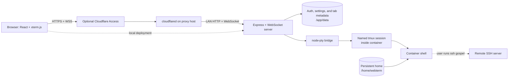

# FlanTerminal

FlanTerminal is a self-hosted, Dockerized browser terminal for replacing a
GoTTY deployment. It provides multiple xterm.js tabs backed by one container-
local tmux session per tab. From any shell, run `ssh hostname` normally. Remote
machines need only an SSH server; they do not need tmux, Zellij, an agent, or
FlanTerminal software.

The project is released under Apache-2.0. Treat access to a deployed instance
as equivalent to shell access as the container's `webterm` user.



Local authentication has two persistent states: without `auth.json`, the
public session endpoint advertises setup-required state and the one-time setup
endpoint accepts enrollment; with a valid `auth.json`, setup is closed and
ordinary sign-in is required. An invalid existing record is a startup error,
not a reason to reopen enrollment.

## Features

- Full-viewport xterm.js terminal with ANSI colors, Unicode, mouse support,
  FitAddon, WebLinksAddon, local copy/paste, responsive resizing, and bounded
  scrollback.
- Persistent browser disconnect/reconnect through container-local tmux.
- Multiple tabs with immutable UUIDs, safe derived tmux names, rename, drag
  reorder, close, restart, reconnect, and per-tab status.
- Atomic JSON persistence for authentication, server-side preferences, and tab
  metadata. Terminal input, output, and scrollback are never stored there.
- Dark, light, and Ubuntu-inspired themes plus a locally bundled JetBrainsMono
  Nerd Font.
- Local bcrypt authentication, Cloudflare Access JWT authentication, and an
  explicit trusted-header mode for an existing authentication proxy.
- CSRF-protected mutations, exact origin checks, secure cookies on HTTPS,
  strict IDs and names, and no terminal data logging.
- Settings and administration views without a permanent sidebar. Preferences
  are server-side, so they follow the deployment across browsers and machines.
- Configurable stale-session cleanup, bounded WebSocket buffering, heartbeat,
  resize debounce, reconnect backoff, resource metrics, and PTY cleanup.
- Debian slim, non-root, read-only-root production image with dropped Linux
  capabilities, `no-new-privileges`, no Docker socket, and limited writable
  mounts.

## Quick start: local authentication

Requirements are Docker Engine and the Docker Compose plugin. The default
Compose file publishes only on loopback (`127.0.0.1`) and enables local
authentication.

```sh
cp .env.example .env
docker compose up -d --build --wait
docker compose ps
```

Before changing the bind address or enabling a reverse proxy, open
<http://localhost:3000>. The first browser to reach a new local deployment can
claim its configured `LOCAL_AUTH_USERNAME` (`webterm` by default) by choosing
and confirming the administrator password. Complete this enrollment while the
service is reachable only from a trusted machine. Passwords must contain 12 to
72 UTF-8 bytes and no NUL byte; characters may use more than one byte.

Successful enrollment bcrypt-hashes the password and atomically writes
`/app/data/auth.json` with mode `0600`. Later visits show the normal sign-in
form. The password is never supplied through Compose, an environment variable,
a command argument, or an application log. Change it from **Settings**; a
password change revokes every application session but does not terminate tmux
sessions.

To deliberately run without application authentication on a trusted network,
set `AUTH_MODE=none` in `.env`, then recreate the container so it receives the
new environment:

```sh
docker compose up -d --build --force-recreate --wait
```

Mode `none` must not be exposed directly to an untrusted network. Authentication
can instead be enforced with the documented Cloudflare Access deployment.

Follow structured logs with:

```sh
docker compose logs -f app
```

`docker compose down` retains named volumes. Do not add `-v` unless deleting
authentication state, preferences, tabs, SSH files, shell history, and scripts
is intentional.

## Terminal workspace

The authenticated default page is the terminal workspace. The plus icon creates
and selects a tab. Double-click a tab label to rename it. Drag tabs to reorder;
Move left and Move right in the session menu are keyboard and touch alternatives.
Closing a tab requires confirmation and terminates only that tab's tmux session.

| Shortcut                | Action                           |
| ----------------------- | -------------------------------- |
| `Ctrl+Shift+T`          | Create and select a tab          |
| `Ctrl+Shift+W`          | Request closing the selected tab |
| `Ctrl+Tab`              | Select the next tab              |
| `Ctrl+Shift+Tab`        | Select the previous tab          |
| `Alt+1` through `Alt+9` | Select a numbered tab            |

Workspace shortcuts can be disabled in Settings. Inline rename fields and
confirmation dialogs keep their normal keyboard behavior.

The selected tab's session menu provides:

- **Reconnect:** open a new WebSocket and PTY attachment.
- **Detach browser:** close this client and suspend automatic reconnect. tmux
  remains alive.
- **Clear scrollback:** clear only the current browser's xterm buffer.
- **Restart terminal client:** recreate xterm and its WebSocket without killing
  tmux.
- **Restart bridge:** replace node-pty and attach again to the same tmux shell.
- **Restart session:** confirm, kill this tab's tmux session, and start a new
  shell without affecting other tabs.
- **Terminate session:** stop tmux but retain the tab as stopped.
- **Recreate session:** create a new tmux shell for a stopped tab.

Only one PTY bridge owns a tab at a time. A replacement browser attachment
closes the previous bridge without killing tmux.

## Server-side settings

Settings are persisted in `/app/data/settings.json`, not browser local storage.
They therefore apply to every browser and machine using this deployment:

- font family and size, line height, and letter spacing;
- browser scrollback and terminal theme;
- cursor style and blinking;
- visual, audible, or disabled bell behavior;
- automatic or manual reconnect;
- automatic initial tab creation and workspace shortcuts;
- default shell from the deployment allowlist;
- tmux history limit; and
- stale-session cleanup hours.

Deployment maximums remain authoritative. A browser cannot raise scrollback,
font size, tmux history, cleanup hours, or shell choices beyond configured
limits. Existing settings remain authoritative after a container upgrade; edit
them in the UI rather than expecting changed defaults to overwrite them.

## Administration

The unobtrusive Administration view reports uptime, RSS and heap memory, tab and
running-session totals, connected WebSockets, active bridges, each bridge PID,
tmux name, timestamps, observed state, cleanup eligibility, and bounded
lifecycle errors.

Available actions are restart bridge, restart session, terminate, recreate,
and run cleanup now. Destructive session actions require confirmation. A stale
cleanup run stops only sessions that are older than the configured threshold,
active in metadata, present in tmux, unattached, unbridged, and free of pending
or recent activity. It marks the tab stopped; it does not delete metadata.
Set stale cleanup hours to `0` to disable cleanup.

## Persistence behavior

Two volumes have separate responsibilities:

- `app-data` at `/app/data`: bcrypt credential record, settings, ordered tab
  records, desired active/stopped state, and timestamps.
- `webterm-home` at `/home/webterm`: `.ssh`, shell configuration, history,
  user scripts, and other home files.

Reloading or closing the browser, losing the network, detaching, or restarting a
bridge removes the PTY bridge but leaves tmux and its child processes alive.
Reconnect attaches to that same container-local session.

A container stop, restart, recreation, host reboot, or image upgrade terminates
tmux, shells, active SSH connections, vim, htop, and shell environment variables.
The volumes survive. Tabs with active intent start fresh shells when attached;
tabs explicitly terminated before restart remain stopped until recreated.

### Test browser disconnect and reconnect

1. In a tab, run:

   ```sh
   export FLANTERMINAL_RECONNECT_MARKER=browser-reconnect-ok
   printf '%s\n' "$FLANTERMINAL_RECONNECT_MARKER"
   ```

2. Reload, close and reopen the browser, or select Detach browser and then
   Reconnect.
3. In the same tab, run the `printf` command again. It should print
   `browser-reconnect-ok`.

The marker does not survive a container restart because it belongs to the shell
process, not a volume.

## SSH setup

The image includes OpenSSH client and never creates or exposes private keys.
Place existing SSH material in the persistent home. This command refuses to
overwrite an existing key:

```sh
docker compose exec -T app sh -c \
  'set -eu; umask 077; mkdir -p "$HOME/.ssh"; test ! -e "$HOME/.ssh/id_ed25519"; temporary=$(mktemp "$HOME/.ssh/id_ed25519.XXXXXX"); trap '\''rm -f "$temporary"'\'' EXIT; cat > "$temporary"; chmod 600 "$temporary"; mv "$temporary" "$HOME/.ssh/id_ed25519"; trap - EXIT' \
  < /path/to/id_ed25519
docker compose exec -T app chmod 700 /home/webterm/.ssh
```

Example `~/.ssh/config` values are illustrative:

```sshconfig
Host gospel
    HostName 192.168.1.50
    User example-user
    IdentityFile ~/.ssh/id_ed25519
```

Then run:

```sh
ssh gospel
```

Verify host-key fingerprints through an independent channel. Do not disable
host-key checking. Optional SSH agent forwarding can be configured by mounting
one intentionally selected socket and setting `SSH_AUTH_SOCK`; it is not
required or enabled by the supplied Compose files.

## Cloudflare Zero Trust deployment

This is the primary recommended reverse-proxy topology when `cloudflared` runs
on another machine:

```text
Browser -> Cloudflare Access -> Cloudflare Tunnel -> cloudflared proxy host
        -> restricted LAN HTTP -> FlanTerminal container
```

Cloudflare Access places an application JWT in the
`Cf-Access-Jwt-Assertion` header. FlanTerminal validates its RS256 signature,
issuer, audience, time claims, and identity against the team JWKS before it
creates an application session or PTY. It repeats that validation on terminal
WebSocket upgrades. See Cloudflare's [JWT validation guide](https://developers.cloudflare.com/cloudflare-one/access-controls/applications/http-apps/authorization-cookie/validating-json/).

### 1. Create the Access application

In Cloudflare Zero Trust, create a self-hosted public-hostname application for
the exact hostname, add a restrictive Allow policy, and configure the desired
identity provider and session duration. Access applications deny by default
until an Allow policy matches. Create Access protection before publishing the
tunnel route, as recommended in Cloudflare's [self-hosted application guide](https://developers.cloudflare.com/cloudflare-one/access-controls/applications/http-apps/self-hosted-public-app/).

From the application's Additional settings, copy the Application Audience
(AUD) tag. Record the team domain shown by Cloudflare, for example
`https://your-team.cloudflareaccess.com`. The application must be able to make
outbound HTTPS requests to that domain's `/cdn-cgi/access/certs` endpoint.

### 2. Configure FlanTerminal

On the FlanTerminal host, set values like these in `.env`:

```dotenv
HOST_BIND_ADDRESS=192.168.1.40
HOST_PORT=3000
APP_BASE_PATH=/
APP_PUBLIC_URL=https://terminal.example.com
CLOUDFLARE_TEAM_DOMAIN=https://your-team.cloudflareaccess.com
CLOUDFLARE_ACCESS_AUD=replace-with-the-application-aud
TRUST_PROXY=false
```

Use the FlanTerminal host's specific LAN address, not `0.0.0.0`, and permit the
port only from the `cloudflared` machine. For example, if the proxy is
`192.168.1.20`, adapt the host firewall to allow only that source:

```sh
sudo ufw allow from 192.168.1.20 to 192.168.1.40 port 3000 proto tcp
sudo ufw deny 3000/tcp
```

Review rule ordering and syntax for the actual firewall before applying it.
Then start the standalone Cloudflare Compose model, which has no local password
secret dependency:

```sh
docker compose -f docker-compose.cloudflare.yml config
docker compose -f docker-compose.cloudflare.yml up -d --build --wait
docker compose -f docker-compose.cloudflare.yml ps
```

`TRUST_PROXY=false` is deliberate. Cloudflare JWT mode does not trust a generic
identity header or require forwarded addresses for authentication.

### 3. Configure cloudflared on the proxy machine

For a locally managed tunnel, use a configuration like:

```yaml
tunnel: 6ff42ae2-765d-4adf-8112-31c55c1551ef
credentials-file: /etc/cloudflared/6ff42ae2-765d-4adf-8112-31c55c1551ef.json

ingress:
  - hostname: terminal.example.com
    service: http://192.168.1.40:3000
    originRequest:
      connectTimeout: 10s
      access:
        required: true
        teamName: your-team
        audTag:
          - replace-with-the-application-aud
  - service: http_status:404
```

The last catch-all rule is required. Validate and test routing before running
the connector:

```sh
cloudflared tunnel ingress validate
cloudflared tunnel ingress rule https://terminal.example.com
sudo systemctl restart cloudflared
sudo systemctl status cloudflared
```

Cloudflare documents the complete [locally managed ingress format](https://developers.cloudflare.com/cloudflare-one/networks/connectors/cloudflare-tunnel/do-more-with-tunnels/local-management/configuration-file/)
and the optional cloudflared [Protect with Access origin setting](https://developers.cloudflare.com/cloudflare-one/networks/connectors/cloudflare-tunnel/configure-tunnels/origin-parameters/).
For a remotely managed tunnel, create the same hostname-to-LAN-service route in
the dashboard and enable Protect with Access using the same team and AUD.

Do not create a separate TCP or SSH tunnel route for the browser terminal. The
application uses an ordinary HTTP service and upgrades its terminal path to a
WebSocket. Cloudflare supports proxied [WebSockets](https://developers.cloudflare.com/network/websockets/);
verify the zone's WebSockets setting is enabled. FlanTerminal's heartbeat and
reconnect logic handle planned or transient edge disconnects.

For a base path, set `APP_BASE_PATH=/terminal`, keep
`APP_PUBLIC_URL=https://terminal.example.com`, browse to
`https://terminal.example.com/terminal/`, and protect the entire hostname or at
least that path in Access. The tunnel must preserve the path.

### 4. Verify the deployment

1. Confirm direct LAN access from any host except the proxy is blocked.
2. Visit the public URL and complete Access authentication.
3. Open a tab, run `printf 'cloudflare-ok\n'`, and verify Connected status.
4. Reload and confirm the same tmux shell remains.
5. Inspect app logs for authentication events without JWTs or terminal data:

   ```sh
   docker compose -f docker-compose.cloudflare.yml logs app
   ```

An Access redirect loop usually means the hostname/path, policy, or Access
cookie scope is wrong. A FlanTerminal "Access could not be verified" page means
the assertion is missing or fails issuer, audience, signature, or expiry checks.

## Nginx example

For local authentication behind Nginx, keep `AUTH_MODE=local`, set
`APP_PUBLIC_URL=https://terminal.example.com`, and bind FlanTerminal only where
Nginx can reach it. Strip spoofable upstream identity headers and preserve the
browser Origin. Nginx requires explicit WebSocket upgrade handling; see its
[WebSocket proxy documentation](https://nginx.org/en/docs/http/websocket.html).

```nginx
map $http_upgrade $connection_upgrade {
    default upgrade;
    ''      close;
}

upstream flanterminal {
    server 127.0.0.1:3000;
}

server {
    listen 443 ssl;
    server_name terminal.example.com;

    ssl_certificate     /etc/letsencrypt/live/terminal.example.com/fullchain.pem;
    ssl_certificate_key /etc/letsencrypt/live/terminal.example.com/privkey.pem;

    location / {
        proxy_pass http://flanterminal;
        proxy_http_version 1.1;
        proxy_set_header Host $host;
        proxy_set_header Upgrade $http_upgrade;
        proxy_set_header Connection $connection_upgrade;
        proxy_set_header X-Real-IP $remote_addr;
        proxy_set_header X-Forwarded-For $proxy_add_x_forwarded_for;
        proxy_set_header X-Forwarded-Proto $scheme;
        proxy_set_header Cf-Access-Jwt-Assertion "";
        proxy_set_header X-Auth-User "";
        proxy_read_timeout 1h;
        proxy_send_timeout 1h;
    }
}
```

Leave `TRUST_PROXY=false` unless the application specifically needs forwarded
client addresses. If enabled, use only the Nginx source IP/CIDR, never a broad
LAN or Internet range.

## Traefik example

Traefik supports WebSockets with normal HTTP routing. A file-provider dynamic
configuration avoids coupling FlanTerminal to the Docker socket:

```yaml
http:
  routers:
    flanterminal:
      rule: Host(`terminal.example.com`)
      entryPoints: [websecure]
      service: flanterminal
      middlewares: [flanterminal-strip-identity]
      tls:
        certResolver: letsencrypt

  middlewares:
    flanterminal-strip-identity:
      headers:
        customRequestHeaders:
          Cf-Access-Jwt-Assertion: ''
          X-Auth-User: ''

  services:
    flanterminal:
      loadBalancer:
        servers:
          - url: http://192.168.1.40:3000
```

Traefik documents both [automatic WebSocket routing](https://doc.traefik.io/traefik/master/user-guides/websocket/)
and [empty-value request-header removal](https://doc.traefik.io/traefik/reference/routing-configuration/http/middlewares/headers/).
Use local authentication unless a separately secured authentication middleware
overwrites a trusted identity header.

## Authentication modes

- `local`: supplied by `docker-compose.yml`. With no `auth.json`,
  `GET /api/auth/session` returns the setup-required state and the first browser
  can submit the password to `POST /api/auth/setup`. Enrollment creates the
  only local administrator credential; later requests use normal sign-in.
  Passwords are bcrypt-hashed at cost 10-15.
- `cloudflare-access`: supplied by `docker-compose.cloudflare.yml`. Every HTTP
  bootstrap and WebSocket upgrade requires a valid Access JWT. There is no
  local enrollment, `auth.json`, password, or generic trusted identity header.
- `trusted-header`: for an existing authentication proxy. Set an explicit
  `TRUST_PROXY` IP/CIDR list and one `TRUSTED_AUTH_HEADER`. The proxy must remove
  every client-supplied copy, authenticate the user, and set exactly one
  normalized identity header on HTTP and WebSocket requests. Direct, duplicate,
  malformed, or untrusted-source headers are rejected.
- `none`: development and isolated testing only. Do not publish it.

FlanTerminal application sessions are memory-only, bounded, idle-limited, and
absolute-limited. Container recreation requires authentication again. Logout or
password change closes authenticated WebSockets but leaves tmux alive. All
state-changing routes require the in-memory CSRF token and exact public Origin.

## Configuration

Environment variables override an optional strict JSON file named by
`APP_CONFIG_FILE`. File keys use camelCase forms such as `port`, `basePath`,
`publicUrl`, `authMode`, `allowedShells`, and `trustProxy`. Mount the file
read-only yourself; the supplied Compose files do not add another writable
path.

| Variable                           | Default                 | Bounds or purpose                                      |
| ---------------------------------- | ----------------------- | ------------------------------------------------------ |
| `APP_PORT`                         | `3000`                  | Internal port, `1..65535`                              |
| `HOST_PORT`                        | `3000`                  | Published host port                                    |
| `HOST_BIND_ADDRESS`                | `127.0.0.1`             | Specific host address for publishing                   |
| `APP_BIND_HOST`                    | `0.0.0.0`               | Container listener address                             |
| `APP_BASE_PATH`                    | `/`                     | Root or a canonical path such as `/terminal`           |
| `APP_PUBLIC_URL`                   | `http://localhost:3000` | Exact browser origin, without a path                   |
| `DATA_DIR`                         | `/app/data`             | Fixed persistent application mount in Compose          |
| `HOME_DIR`                         | `/home/webterm`         | Fixed persistent shell home in Compose                 |
| `SESSION_MAX_COUNT`                | `10`                    | Tab/session limit, `1..20`                             |
| `DEFAULT_SHELL`                    | `/bin/bash`             | Initial shell; must be in `ALLOWED_SHELLS`             |
| `ALLOWED_SHELLS`                   | `/bin/bash`             | Comma-separated absolute executable paths              |
| `DEFAULT_FONT_SIZE`                | `14`                    | Initial setting, `8..32`                               |
| `MAX_FONT_SIZE`                    | `32`                    | Browser setting ceiling, `8..32`                       |
| `XTERM_SCROLLBACK`                 | `10000`                 | Initial browser lines, clamped to `0..100000`          |
| `MAX_XTERM_SCROLLBACK`             | `100000`                | Browser safety ceiling                                 |
| `TMUX_HISTORY_LIMIT`               | `20000`                 | Initial tmux lines, `0..1000000`                       |
| `MAX_TMUX_HISTORY_LIMIT`           | `1000000`               | tmux safety ceiling                                    |
| `MAX_STALE_SESSION_CLEANUP_HOURS`  | `8760`                  | Cleanup setting ceiling                                |
| `SESSION_CLEANUP_INTERVAL_MINUTES` | `15`                    | Background interval, `5..1440`                         |
| `WS_HEARTBEAT_SECONDS`             | `30`                    | Ping interval, `5..300`                                |
| `WS_MAX_BUFFER_BYTES`              | `1048576`               | Pending output, `65536..1048576`                       |
| `RESIZE_DEBOUNCE_MS`               | `100`                   | Resize debounce, `25..1000`                            |
| `RECONNECT_MAX_SECONDS`            | `15`                    | Backoff cap, `1..60`                                   |
| `AUTH_MODE`                        | `local`                 | `local`, `cloudflare-access`, `trusted-header`, `none` |
| `LOCAL_AUTH_USERNAME`              | `webterm`               | Enrolled local administrator, 1-64 characters          |
| `BCRYPT_COST`                      | `12`                    | bcrypt cost, `10..15`                                  |
| `AUTH_IDLE_MINUTES`                | `60`                    | Idle application-session lifetime, `1..10080`          |
| `AUTH_ABSOLUTE_HOURS`              | `24`                    | Absolute lifetime, `1..8760`                           |
| `AUTH_SESSION_MAX_COUNT`           | `32`                    | Concurrent application sessions, `1..256`              |
| `CLOUDFLARE_TEAM_DOMAIN`           | unset                   | Required HTTPS `*.cloudflareaccess.com` origin         |
| `CLOUDFLARE_ACCESS_AUD`            | unset                   | Required Access application AUD                        |
| `TRUST_PROXY`                      | `false`                 | `false`, hop count `1..8`, or up to 16 IP/CIDRs        |
| `TRUSTED_AUTH_HEADER`              | `X-Auth-User`           | Header name for trusted-header mode only               |
| `LOG_LEVEL`                        | `info`                  | Pino level or `silent`                                 |
| `PUID` / `PGID`                    | `1000`                  | Build-time runtime identity; rebuild to change         |
| `TZ`                               | `UTC`                   | `.env.example` shows `America/Denver` as an example    |

## Performance bounds

FlanTerminal is designed to avoid progressive slowdown:

- no backend terminal output history and no input/output logging;
- 10,000 browser scrollback lines and 20,000 tmux lines by default;
- 64 KiB maximum WebSocket message and 16 KiB maximum input frame data;
- 1 MiB bounded pending output with backpressure closure;
- 100 ms resize debounce;
- 30-second ping/pong heartbeat and dead-client cleanup;
- reconnect delays of 0.5, 1, 2, 4, and 8 seconds, then the configured cap;
- one keyed node-pty bridge per tab, replaced and killed on disconnect;
- bounded activity tracking and atomic metadata writes; and
- Compose limits of 512 MiB memory and 256 PIDs.

Closing a bridge for backpressure or network loss does not kill tmux. Reduce
scrollback, tmux history, or the socket buffer for constrained deployments.

## Health and logging

Health routes are deliberately outside `APP_BASE_PATH`:

- `GET /health`: `status`, uptime, RSS/heap bytes, active bridges, and connected
  WebSockets.
- `GET /ready`: HTTP 200 only when startup and metadata durability are ready;
  otherwise HTTP 503.

Docker validates the structured `/health` response. Do not expose health routes
through a public path unless the proxy configuration intentionally permits it.

Pino logs application startup, authentication events, tab/session lifecycle,
WebSocket connect/disconnect, PTY bridge cleanup, administration actions, and
bounded errors. It does not log keystrokes, terminal output, JWTs, passwords,
private keys, cookies, CSRF tokens, or secret environment values. Configure
retention and rotation in the container runtime or log collector.

## Font licensing

The app bundles JetBrainsMono Nerd Font v3.4.0 locally and makes no font CDN
request. Source/archive hashes are in [LICENSES/README](LICENSES/README), and
the SIL Open Font License is in
[LICENSES/JetBrainsMono-OFL.txt](LICENSES/JetBrainsMono-OFL.txt). Fallbacks
include `ui-monospace`, `Noto Sans Mono`, `Symbols Nerd Font`,
`Noto Color Emoji`, and `monospace`.

## Development and tests

Local development requires Node.js 24+, npm, tmux at `/usr/bin/tmux`, and SSH
at `/usr/bin/ssh`:

```sh
npm ci
HOME_DIR="$HOME" DATA_DIR=/tmp/flanterminal-data AUTH_MODE=none npm run dev
```

Open <http://localhost:5173>. Vite proxies `/api` and `/ws` to the backend. For
containerized hot reload, use `Dockerfile.dev` and mount the working tree with
explicit development-only settings.

Quality gates:

```sh
npm run format:check
npm run lint
npm run typecheck
npm test
npm run build
docker compose build
npm run test:e2e
./scripts/verify-container.sh
./scripts/verify-container.sh --check hardening
```

Playwright builds production images and tests local authentication and a fully
offline HTTPS Cloudflare JWKS fixture at both `/` and `/terminal`. The container
verifier covers password/settings/home persistence, session loss on recreation,
tmux process loss, stale cleanup isolation, session limits, 20 simultaneous
authenticated bridges, PTY cleanup, health, ownership, hardening, and redaction.

### Repository layout

- `apps/client`: React, Vite, xterm.js, workspace, settings, and administration
  UI.
- `apps/server`: Express, authentication, WebSockets, node-pty, tmux lifecycle,
  persistence, cleanup, and metrics.
- `packages/shared`: strict HTTP, WebSocket, tab, settings, and administration
  contracts shared by the browser and server.
- `e2e`: authenticated browser workflows and the offline Cloudflare Access
  fixture client.
- `scripts`: production artifact, Docker runtime, hardening, persistence, and
  E2E verification.
- `docker-compose*.yml`: local authentication, Cloudflare Access, example bind
  mounts, and isolated test deployments.

See [CONTRIBUTING.md](CONTRIBUTING.md) before submitting changes. Report
security issues privately as described in [SECURITY.md](SECURITY.md); do not
open public issues containing vulnerabilities, credentials, private keys, or
deployment details.

## Backup and restore

Stop the app so atomic metadata and home files are quiescent, then archive both
volumes:

```sh
mkdir -p backups
docker compose stop app
docker compose run --rm --no-deps -T app \
  tar -C /app/data -cpf - . > backups/app-data.tar
docker compose run --rm --no-deps -T app \
  tar -C /home/webterm -cpf - . > backups/webterm-home.tar
docker compose start app
```

Inspect before restoring:

```sh
tar -tf backups/app-data.tar | less
tar -tf backups/webterm-home.tar | less
```

Restore into the intended stopped deployment with matching `PUID`, `PGID`, and
`LOCAL_AUTH_USERNAME`:

```sh
docker compose stop app
docker compose run --rm --no-deps -T app \
  tar -C /app/data -xpf - < backups/app-data.tar
docker compose run --rm --no-deps -T app \
  tar -C /home/webterm -xpf - < backups/webterm-home.tar
docker compose start app
docker compose ps
```

This is an overlay restore. For an exact rollback, restore into empty volumes
in a separate Compose project, verify, then switch deployments. Encrypt backups
because the home archive may contain private SSH keys and the app archive
contains `auth.json` and its password hash. Restoring `auth.json` restores the
enrolled local credential; keep its configured username consistent.

## Upgrades

Back up both volumes and retain the previous image tag:

```sh
docker compose stop app
docker compose build --pull
docker compose up -d --force-recreate --wait
docker compose ps
curl --fail http://127.0.0.1:3000/health
curl --fail http://127.0.0.1:3000/ready
```

An upgrade ends active tmux processes. Existing `auth.json`, `settings.json`,
and `tabs.json` files continue to work unchanged, and no reenrollment is
required. Changing a deployed local username after `auth.json` exists is
rejected rather than silently creating another account. An obsolete
`secrets/local_auth_password` file from an older deployment is unused and may
be securely removed after the upgraded deployment passes sign-in and health
checks.

## Security considerations

- Treat authenticated access as arbitrary shell access with all privileges of
  `webterm` and every SSH key available in its home.
- Prefer Cloudflare Access or local auth over trusted headers. A trusted-header
  deployment is only as strong as its source-IP restriction and header rewrite.
- Complete local administrator enrollment before exposing the service beyond a
  trusted machine. An uninitialized local deployment is a first-visitor claim
  window, not a login screen.
- Keep public Origin exact. Do not use wildcards for `APP_PUBLIC_URL` or trusted
  proxies.
- Keep `.ssh` mode `0700`, private keys/config/known-host files `0600`, and
  public keys `0644`.
- Keep `/app/data/auth.json` and other application metadata private; never serve
  either persistent volume through another web server.
- The container is non-root with a read-only application filesystem, but its
  persistent home intentionally permits arbitrary user scripts and SSH data.
- Protect and encrypt backups. Test restores away from production.
- Do not put secrets in tab display names. Names are validated and never used
  as tmux names, but they are persisted and displayed.
- No supplied container mounts the Docker socket or requires privileged mode.
- Use `AUTH_MODE=none` only on a trusted, isolated network. Setup passwords and
  other secrets do not belong in URLs, route parameters, environment files,
  command arguments, or logs.

## Troubleshooting

**Container fails before listening:** check strict environment values,
persisted username consistency, writable volume ownership, and structured logs.
A missing `auth.json` is valid setup state, but an existing malformed, unsafe,
oversized, symlinked, or unreadable file fails closed. Startup errors
intentionally omit credential details.

**The setup screen appears:** this is expected only when local mode has no
`auth.json`. The configured username is read-only. Complete enrollment from a
trusted machine before exposing the service. If another browser enrolls first,
the setup request reports that setup was already completed and returns to normal
sign-in.

**Login always fails or the password is lost:** first confirm the running mode
with `docker compose exec app printenv AUTH_MODE`. For local credential recovery,
stop the service or block every untrusted network and proxy path, retain a full
app-data backup, delete only `auth.json`, restart while still isolated, complete
first-browser enrollment, verify normal sign-in, and only then restore proxy or
network exposure. Deleting `auth.json` reopens the first-visitor claim window.
Restarting the container also terminates its tmux processes, although tab
metadata and home data remain.

```sh
docker compose stop app
mkdir -p backups
docker compose run --rm --no-deps -T app \
  tar -C /app/data -cpf - . > backups/app-data-before-password-reset.tar
docker compose run --rm --no-deps --entrypoint sh app \
  -c 'rm -f /app/data/auth.json'
docker compose up -d --build --force-recreate --wait
```

Keep the deployment isolated after the final command. Browse to its trusted
local address, enroll a 12 to 72 UTF-8-byte, NUL-free password, sign out and
back in, and only then re-enable public routing.

**Cookie or mutation failure behind HTTPS:** `APP_PUBLIC_URL` must exactly match
the browser scheme, host, and port. `APP_BASE_PATH` is not included in that
origin. Mutations require the exact Origin, and cookies are scoped to the base
path and marked Secure when the public URL uses HTTPS.

**WebSocket 401/403 or reconnect loop:** verify the public Origin, base path,
proxy upgrade support, application cookie, and authentication headers. In
Cloudflare mode, confirm team domain, AUD, Access policy, JWKS reachability, and
that the assertion reaches the WebSocket upgrade.

**Cloudflare 502:** from the cloudflared host, test
`curl http://FLANTERMINAL_LAN_IP:3000/health`; then check the LAN firewall,
tunnel service URL, and `cloudflared` logs.

**Base-path 404:** set `APP_BASE_PATH=/terminal` without a trailing slash,
preserve the path in the proxy, and browse to `/terminal/`. Health stays at
`/health`, not `/terminal/health`.

**Ready is 503:** inspect free space, `/app/data` ownership, file modes, and
structured logs. Secure metadata files must not be symlinks or oversized.

**SSH rejects a key or host:** inspect `.ssh` modes and independently verify the
remote fingerprint. Do not disable verification.

**Session stopped after container recreation:** expected. Tab metadata and home
survive; tmux processes do not. Attach an active-intent tab for a fresh shell or
select Recreate for an intentionally stopped tab.

**Slow high-volume output:** reduce browser scrollback, tmux history, or pending
socket bytes. Backpressure closes the bridge, and reconnect returns to tmux.

## Version 1 boundaries

FlanTerminal is a single-workspace terminal, not a multi-tenant isolation
system. It intentionally omits file/SFTP browsing, terminal recording,
collaborative sharing, Kubernetes deployment, remote inventory or agents,
Docker management, automatic credential creation, remote tmux management,
command auditing, and cross-host shell-history synchronization.

Only one browser bridge controls a tab at a time. Terminal scrollback is local
to each browser and is not restored after a reload. Active processes do not
survive a container lifecycle event.

## License

FlanTerminal is licensed under the [Apache License 2.0](LICENSE). The bundled
JetBrainsMono Nerd Font remains licensed separately under the SIL Open Font
License documented in [LICENSES/README](LICENSES/README).
